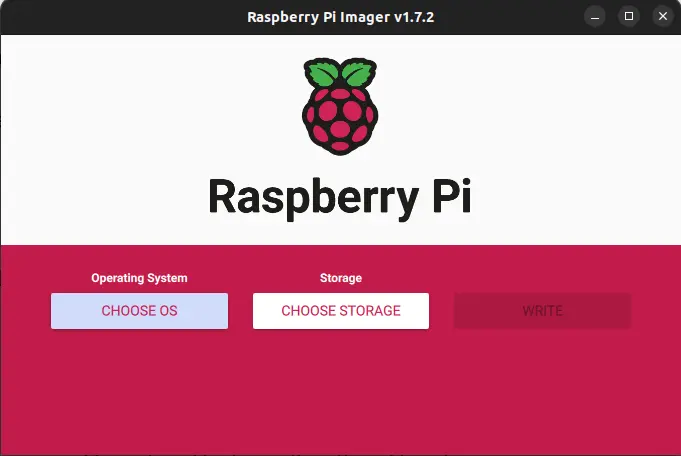
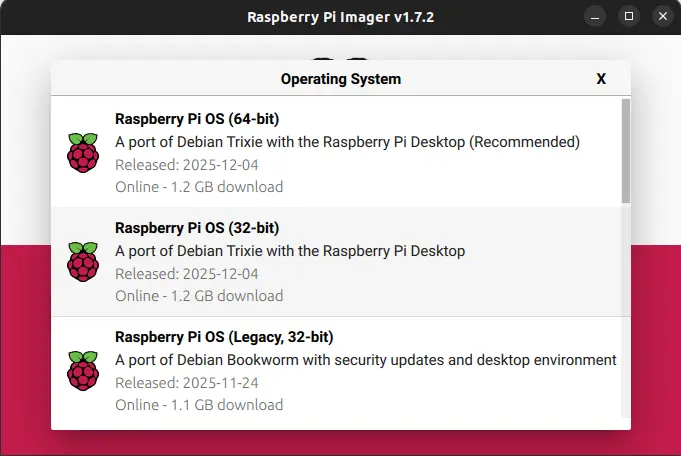
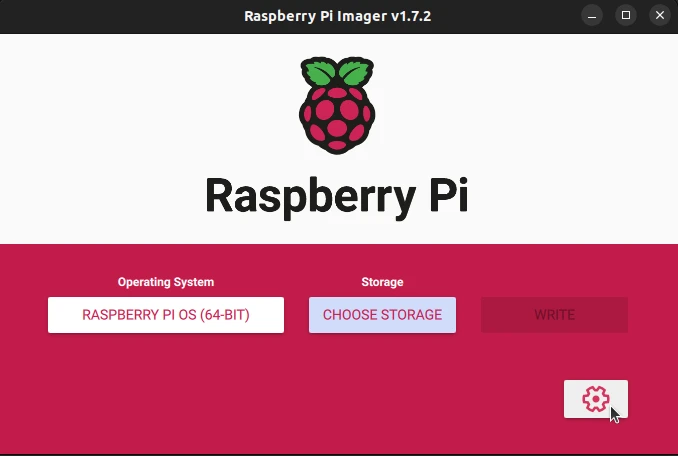
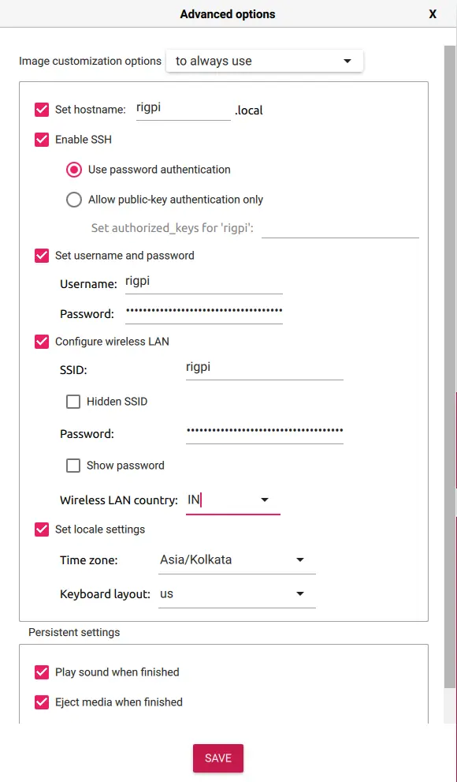
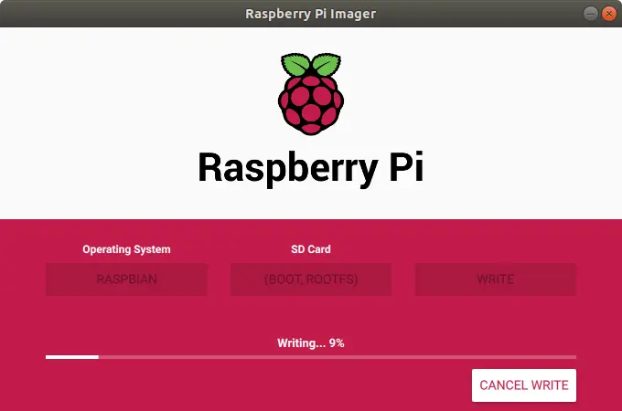
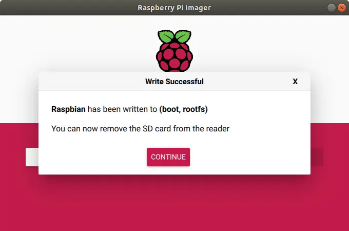

# Baking a Pi

If you are new to the Raspberry Pi, Linux, or even basic networking — **don’t worry**.  
This guide is written for *absolute beginners* who want to set up their Raspberry Pi **without using any monitor, keyboard, or mouse**.

This method is called **headless setup** — your laptop will act as the screen for your Raspberry Pi.

By the end of this guide, you will know:
- how to install the Raspberry Pi OS,
- how to connect the Pi to your Wi-Fi,
- how to enter the Pi using “SSH” (don’t worry, we explain it),
- and how to start using your Pi like a tiny computer.

Let’s bake the Pi 🍰🔥

---

## Ingredients Required
You will need only a few items:

- **Raspberry Pi 3 / 4 / 5**  
  *(Optional: Case and cooling accessories)*

- **Storage Options**
  - SD Card + Card Reader  
  - OR USB Flash Drive  
  - **16 GB minimum**, **32 GB recommended**

- **Rated Power Adapter** for your Pi 
  This is important — a weak charger can prevent the Pi from booting.

---

## Optional Items
You don’t need these for a headless setup, but they help for troubleshooting:

- Monitor/TV with HDMI
- HDMI cable

> **Note:** These are only required if the OS fails to boot and troubleshooting is needed. **You can ignore these if everything goes well.**

---

# Baking the Raspberry Pi

## Step 1 — Prepare the Hardware
1. Place the Pi inside its **case** (for protection).  
2. Add **heatsinks or a fan** to keep it cool.  
3. Keep your SD card or USB pen drive ready.

That’s it for hardware!

---

## Understanding `hostname`, `username`, Wi-Fi & `ssh`
When installing the OS, Raspberry Pi Imager will ask you for a few details.  
If you are new to computers/Linux, these might sound confusing — so here's a simple explanation.

---

###  What is a Hostname?
Think of your Raspberry Pi like a person in a classroom.

A **hostname** is simply the *name* you give to your Raspberry Pi.  
It helps you find your Pi on your network.

Example hostnames:
- `rigpi`
- `robot-controller`
- `senthil-pi`

Later you will connect to your pi remotely using ssh:
```
hostname.local
```
Example:
```
rigpi.local
```

It’s just a **name tag** for your device.

---

###  What is a Username?
This is the account you will use to log into the Pi.

Raspberry Pi OS no longer has a default “pi” account.  
So you must create:

- **your own username**
- **your own password**

This is what you will type when connecting via SSH.

---

###  Why Set Up Wi-Fi?
Your Raspberry Pi does not know your Wi-Fi network.  
So you must tell it:

- the Wi-Fi name (SSID),
- the password.

This allows the Pi to automatically connect to your network the moment it turns on.

If you skip this → you cannot access the Pi headlessly.

---

###  Why Enable SSH?
SSH stands for **Secure Shell**.  
It lets you control your Raspberry Pi from your **laptop**, using text commands.

Think of it like opening a “remote window” into your Pi.

SSH is OFF by default for safety.  
So we enable it here to make the first connection easy.

---

## Step 2 — Flash the Operating System
This installs the Raspberry Pi OS onto your SD card or USB drive.

---

### 1. Plug storage into your computer  
Insert your SD card or USB stick using a card reader.

---

### 2. Install Raspberry Pi Imager  
Download from:  
https://www.raspberrypi.com/software/

Open the app.

> 

---

### 3. Select your Device and OS  
Choose:
- Your Pi model  
- The recommended Raspberry Pi OS

> 

---

### 4. Edit Settings  
Click the **gear icon** (⚙️) to configure important details.

> 

Here you will enter:
- hostname  
- username  
- password  
- Wi-Fi details  
- enable SSH  

Take your time — these are needed for headless setup.

> 

---

### 5. Write the OS  
Click **Write**, wait a few minutes.

> 

Once it's done:

> 

Your SD card/USB is now ready!

---

## Step 2.1 — Enabling USB Boot  
*This step is ONLY for users who want to boot their Raspberry Pi from a **USB flash drive** instead of an SD card.*

Most Raspberry Pi models (Pi 3A, 3B+, Pi 4, Pi 400, Pi 5) already support USB boot,  
but some Pi models (Pi 3B) require you to **enable USB boot manually**.

Don't worry — it’s just one small file edit.

---

###  What We Are Doing
We will add one line to a file named:

```
/boot/config.txt
```

This tells the Raspberry Pi to try **USB devices before SD cards** when booting.

---

###  Steps to Enable USB Boot

1. **After flashing the OS**, do NOT eject the SD card/USB yet.

2. Open the **boot partition** of the flashed storage device.  
   (It appears like a normal USB drive on Windows, macOS, or Linux.)

3. Find the file:

```
config.txt
```

4. Open it using any simple text editor such as:  
   - Notepad (Windows)  
   - TextEdit (macOS)  
   - VS Code / nano / etc.

5. Scroll to the bottom of the file and add this line:

```bash
program_usb_boot_mode=1
```

6. **Save and close the file.**

7. Now safely **eject the storage device** from your computer.

---

###  That’s It!
Your Raspberry Pi will now check for a **USB drive first**  
and will boot from it if available.

This is extremely useful if:
- you want faster read/write speeds than SD cards  
- you want better durability for robotics projects  
- you prefer using USB SSDs or flash drives

---

> ⚠ **Note:**  
> After enabling USB boot the FIRST time, you can remove this line later.  
> The setting is stored permanently in the Pi’s EEPROM.

---
---

## Step 2.1 — Enabling USB Boot  
*This step is ONLY for users who want their Raspberry Pi to boot from a **USB flash drive or SSD** instead of an SD card.*

Not all Raspberry Pi models behave the same:

###  Models that **DO NOT need** manual USB boot enabling  
These support USB boot out-of-the-box:  
**Raspberry Pi 4B, Raspberry Pi 400, Raspberry Pi 5, Raspberry Pi 3B+, Raspberry Pi 3A+, Raspberry Pi Zero 2 W**

### ⚠ Model that **DOES need** manual USB boot enabling  
Only one main model requires this change:

- **Raspberry Pi 3 Model B (non-Plus)**

If you are using Pi 3B (not 3B+), follow this section.

---

#  What Are We About to Do?

We need to add **one line** to the Raspberry Pi’s configuration file:

```
program_usb_boot_mode=1
```

This tells the Pi to **permanently enable USB boot**.

Once set even *one time*, the Pi remembers this setting forever.

---

# IMPORTANT: File Location Depends on Raspberry Pi OS Version

### 🟢 **If you are using Raspberry Pi OS Bookworm (2023 or newer)**  
(Bookworm changes the boot folder structure)

Edit this file:

```
/boot/firmware/config.txt
```

This is the **real** config file.

---

### 🟡 **If you are using Raspberry Pi OS Bullseye or older**  
(Older systems used traditional boot layout)

Edit this file:

```
/boot/config.txt
```

This was the real config file in older versions.

---

#  Steps to Enable USB Boot

### 1. After flashing the OS, do NOT eject the SD card/USB yet.  
Your computer will show a drive named **boot** or **bootfs**.

### 2. Open the boot partition  
On your computer, open the partition that appears after flashing.

You should see files like:  
`cmdline.txt`, `config.txt`, `overlays/`, `vmlinuz`, etc.

### 3. Find the correct config.txt file  

#### For Bookworm (new systems)
Go into:

```bash
boot/firmware/
```

and open:

```bash
config.txt
```

#### For older OS
Open the `config.txt` in the root of the boot partition.

---

### 4. Add this line at the **bottom** of the file:

```bash
program_usb_boot_mode=1
```

### 5. Save the file  
Close the editor.

### 6. Eject the storage drive safely  
Remove it from your computer.

---

#  Done! USB Boot is Now Enabled  
When you start your Raspberry Pi 3B:

- It will now look for **USB drives first**,  
- And will boot from USB if the OS is installed there.

This setting is **saved permanently in the Pi’s firmware**,  
so you don’t need to add the line again in the future.

---

> ⚠ **Note:**  
> If using Raspberry Pi OS Bookworm, the old `/boot/config.txt` will display:  
> “DO NOT EDIT THIS FILE — The file you are looking for has moved to /boot/firmware/config.txt”

This is normal — just use the new path `/boot/firmware/config.txt`.

---


# Step 3 — The First Boot (Headless Setup)

### 1. Insert the SD card / USB  
Put it into the Raspberry Pi.

### 2. Power the Pi  
Connect the power adapter.  
A green LED will blink — this means it's working.

### 3. Wait 2–3 minutes  
The Pi configures itself and reboots automatically.

### 4. Connect from your laptop (SSH)

On your laptop, open:
- **Terminal** on Mac/Linux  
- **PowerShell** or “Command Prompt” on Windows  

Type:

```bash
ssh username@hostname.local
```

Example:
```bash
ssh senthil@rigpi.local
```

>⚠ **Note:**
>Your **Pi** and your **PC** should be on the **same network** to use *`ssh`* remote access


### 5. Approve the connection  

Type:
```
yes
```
Enter your password.

You are now **inside your Raspberry Pi** — without needing a monitor or keyboard 


>Once your Terminal user details had changed into `<pi-hostname>@<pi-username>`,
>**You are now officially inside your Raspberry Pi !** 
>**Congratulations 🎉!** You have baked your first Raspberry Pi Successfully.

---

## Conclusion
Your Raspberry Pi is now **baked, spiced, and ready to serve**! 🍽️  

You successfully:
- installed the OS  
- configured Wi-Fi and SSH  
- booted the Pi headlessly  
- and accessed it from your laptop  

This is the foundation of robotics, IoT, and Linux-based projects.

You’re officially a Raspberry Pi user now. 

---

